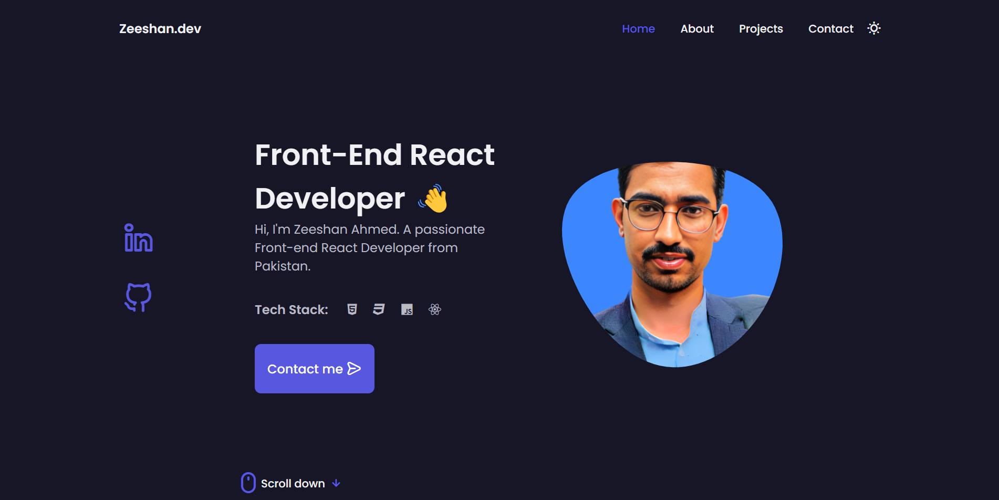
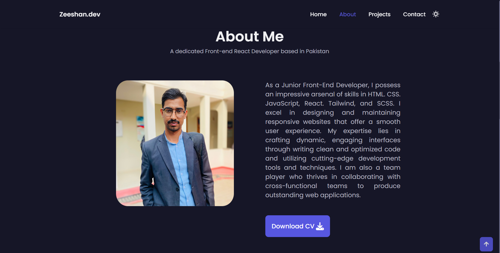
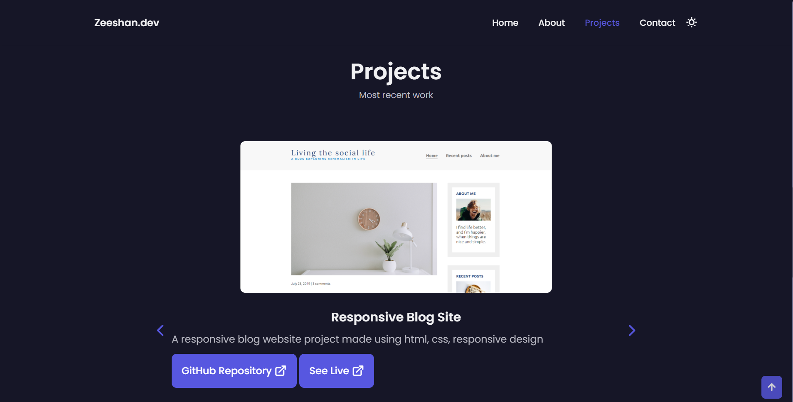
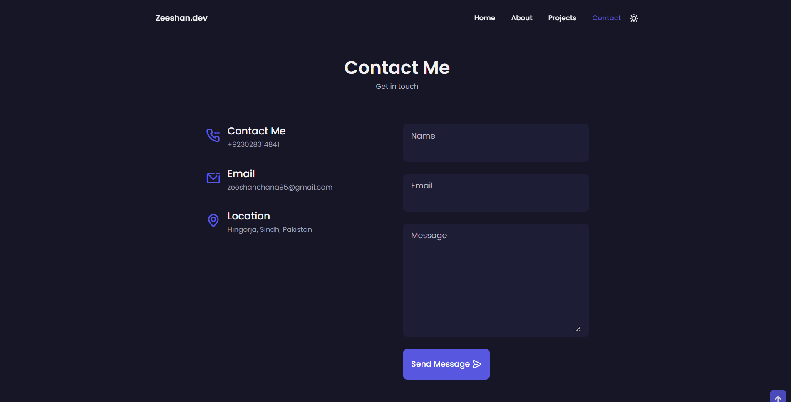

# Personal Portfolio Website

This repository contains the source code and files for my personal portfolio website.

## Description

The personal portfolio website showcases my skills, projects, and experiences as a web developer. It serves as an online platform to highlight my work and provide information about my background and expertise.

## Features

- Home: Introduces myself and provides a brief overview of my skills and interests.
- About: Details my professional background, education, and relevant experience.
- Projects: Showcases the projects I have worked on, including descriptions, screenshots, and links to live demos or repositories.
- Tech Stack: Lists the programming languages, frameworks, and tools I am proficient in.
- Contact: Offers various ways to get in touch with me, such as through email, social media, or a contact form.

## Getting Started

To view the website locally follow these steps:

1. Clone the repository: `git clone [repository URL]`
2. Open the project folder in your preferred code editor.
3. Open the `index.html` file in a web browser to view the website.

## [Live Demo](https://zeeshanchana95.github.io/updated-portfolio-zeeshan/)

## Interface:

## Contact
Thank you for visiting my personal portfolio repository! I hope you find it informative and visually appealing.
